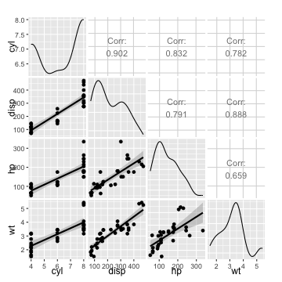

Project Shiny
========================================================
author: Joost van Brakel
date:  1/30/2016
**coursera**

The mission
========================================================
To help people better understand the expected fuel economy of their cars we wanted to build an interactive app that will do that. 

Key design factors : 
- Estimate will be based on a regression model .
- Easily accessible parameters

The approach
=======================================================
--
The data utilized was extracted from the 1974 Motor Trend US magazine, and comprises fuel consumption (MPG) and 10 aspects of automobile design and performance for 32 automobiles (1973–74 models). The data utilize is part of R and is called ‘mtcars’. It was pulled into the dataset variable for analysis and no transformation were performed for this analysis.

***

 
Factors available : 
* mpg,       Miles/(US) gallon
* cyl,	      Number of cylinders
* disp,	Displacement (cu.in.)
* hp,	      Gross horsepower
* drat,	Rear axle ratio
* wt,	      Weight (lb/1000)
* qsec,	1/4 mile time
* am,	      Transmission (0 = automatic, 1 = manual)
* gear,	Number of forward gears
* carb,	Number of carburetors

The Model
========================================================
--
 
All factors were review, however not all factors had a heigh enough correlation (80+).
Four factors had the heighest correlations, which are weight, horsepower, number of cylinders and displacement.

 

***
 
The model with weight and horsepower factors resulted in the best models. The model results are included below.

<!-- html table generated in R 3.1.2 by xtable 1.7-4 package -->
<!-- Sat Jan 30 16:37:03 2016 -->
<table border=1>
<caption align="top"> Model 2 </caption>
<tr> <th>  </th> <th> Estimate </th> <th> Std. Error </th> <th> t value </th> <th> Pr(&gt;|t|) </th>  </tr>
  <tr> <td align="right"> (Intercept) </td> <td align="right"> 37.2273 </td> <td align="right"> 1.5988 </td> <td align="right"> 23.2847 </td> <td align="right"> 0.0000 </td> </tr>
  <tr> <td align="right"> wt </td> <td align="right"> -3.8778 </td> <td align="right"> 0.6327 </td> <td align="right"> -6.1287 </td> <td align="right"> 0.0000 </td> </tr>
  <tr> <td align="right"> hp </td> <td align="right"> -0.0318 </td> <td align="right"> 0.0090 </td> <td align="right"> -3.5187 </td> <td align="right"> 0.0015 </td> </tr>
   </table>

To forecast the MPG usage of the car you will have to fill in the following formula : 
MPG usage = 37.2 - 3. 88 x Weight - 0.03 x Horsepower

The app
=======================================================
The ShinyApp has two inputs and one output. It is based on the regression model shown on the earlier pages. To make the input simple we provided two sliders which are than 

Inputs : 
- Weight
- Horsepower

Ouput : 
- Estimated Fuel economy (MPG)
